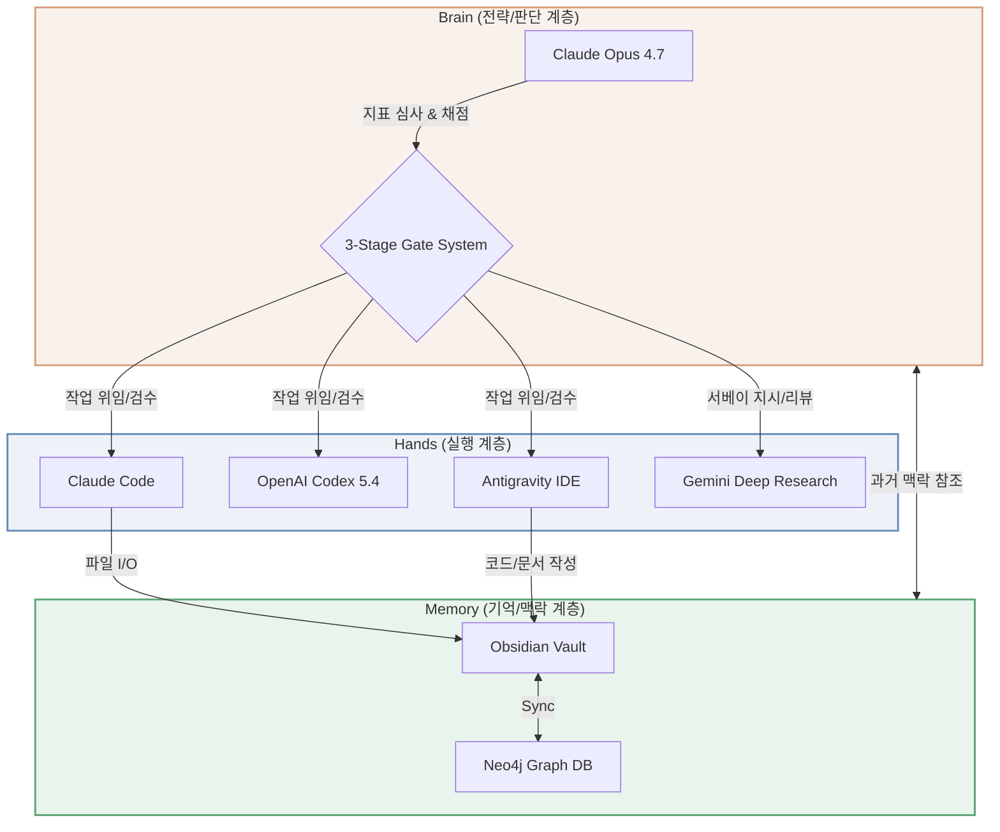

# 🧠 woosdom

**한 명의 인간이 4개의 AI 엔진을 지휘하여 전략 수립부터 코드 구현, 검증, 보안 감사까지 달성하는 통합 AI 오케스트레이션 레포지토리.**

현직 건축가가 5년의 설계 실무 경험(수많은 제약 조건 속에서 최적해를 조율하는 과정)을 바탕으로 구축한 AI 시스템의 포트폴리오입니다. 단일 에이전트에 의존하지 않고, Claude, GPT, Gemini, Antigravity를 적재적소에 배치하여 환각을 억제하고 검증 가능한 엔지니어링 결과를 도출합니다.

*   **생성자 ≠ 검증자**: 한 모델이 코드를 작성하면 다른 아키텍처의 모델이 코드 리뷰와 감사를 수행합니다.
*   **3-Stage Gate 검증**: 의사결정의 편향을 막고 오작동을 차단하는 다단계 판정 시스템을 운영합니다.
*   **Fail-Driven 운영**: 모든 실패를 은폐하지 않고 시스템 프롬프트(Core Safety Rules)로 피드백하여 시스템을 성장시킵니다.

> **Note**: 본 저장소는 전체 시스템 Vault에서 사용자의 개인정보와 보안 기밀을 안전하게 제거한(Redacted) 공개용 스냅샷입니다.

---

## 🏛️ Architecture

시스템은 크게 전략을 통제하는 판단 계층(Brain), 실제 작업을 수행하는 실행 계층(Hands), 그리고 의사결정을 영구히 기록하고 참조하는 기억 계층(Memory)의 3단계로 동작합니다.



---

## 💡 Proof Points — 실증 사례 3건

본 시스템이 실제 문제를 어떻게 해결했는지 증명하는 3가지 대표 사례입니다.

### Case A: 데이터 기반 투자 의사결정 (레버리지 전략 전수 검증)
서베이(DR)와 백테스트 연산(Codex) 파이프라인을 결합하여 20,000 경로의 몬테카를로 시뮬레이션 및 수백 개의 ETF 조합 브루트포스를 실행했습니다. "전 시나리오 기각(FAIL)"이라는 명확한 데이터 기반 결론을 도출했으며, AI가 초기에 범한 프레이밍 과실을 인간이 교정해 나간 과정을 기록했습니다.
* [→ 블로그 포스트 읽기]([BLOG_URL_A])

### Case B: AEC SaaS MVP 구축 및 배포 (Blocs)
React, FastAPI, Cloudflare 인프라를 바탕으로 한국 건축법 법규조회 자동화 봇을 4개 엔진의 협업으로 구축했습니다. 수백 건의 테스트 망(pytest, vitest, e2e)을 통해 P0 버그를 사전에 차단하고, 무결점으로 브랜드 이전을 수행하며 배포 파이프라인을 구축한 사례입니다.
* [→ 블로그 포스트 읽기](https://ahnsemble.com/blog/aec-saas-mvp-with-4-engine-ai/)

### Case C: 자체 인프라 보안 감사 (MCP 취약점 대응)
전 세계 1억 5천만 회 이상의 다운로드가 일어난 MCP STDIO 원격 코드 실행 취약점(RCE)이 공개되었을 때, 48시간 이내에 자체 시스템 노출 감사 및 완화 조치(DR 서베이 + Brain의 교차 검증)를 수행했습니다. 시스템의 안전성을 자체적으로 지켜낸 방어 사례입니다.
* [→ 블로그 포스트 읽기]([BLOG_URL_C])

---

## 🚀 Usage (시작하기)

이 레포지토리의 시스템은 공개된 redact 스냅샷을 검증, 열람하는 과정을 포함합니다. 사용자 자신의 환경에서 검증 스크립트를 테스트하려면 다음을 수행하세요.

```bash
# 1. 저장소 클론
git clone https://github.com/ahnsemble/woosdom.git
cd woosdom

# 2. 파이썬 환경 설정 (Python 3.12 권장)
python -m venv venv
source venv/bin/activate
pip install -r scripts/requirements.txt

# 3. Redact 시스템 무결성 검증 (대외비 스캔 스크립트 실행)
./scripts/verify.sh ./docs ./cases

# 정상 통과 시 "✅ All verification checks passed" 메세지 출력
```

---

## 📂 Directory Structure

레포지토리는 본질적인 설계 원칙과 아키텍처 문서, 실제 수행 사례를 포함합니다. 전체 파일 수는 15개 이상으로 유지됩니다.

```text
woosdom/
├── README.md                          # 메인 소개 문서
├── LICENSE                            # 라이선스 파일
├── .gitignore                         # 버전 관리 제외 문서 (OS/IDE 특화)
│
├── docs/                              # 아키텍처 및 시스템 원칙
│   ├── architecture.md                # 4엔진 시스템 계층 상세
│   ├── gate-system.md                 # 3-Stage 게이트 품질 검증 로직
│   ├── memory-layer.md                # Obsidian 및 GraphRAG 구조 상세
│   └── design-principles.md           # 실패 기반 핵심 규칙(Core Safety)
│
├── cases/                             # AI 오케스트레이션 수행 결과
│   ├── case-a-data-driven-decision.md # 레버리지 투자 백테스트 기각 사례
│   ├── case-b-aec-saas-mvp.md         # 자동화 블록 구축 실증 (MVP)
│   └── case-c-security-audit.md       # 긴급 취약점 RCE 대응 감사
│
├── prompts/                           # 지시어 스냅샷 (Redacted)
│   ├── brain-directive-redacted.md    # 뇌(Brain) 엔진 행동 강령
│   ├── gate-scorecard-template.md     # 리뷰 채점용 스코어카드 양식
│   └── delegation-checklist.md        # AI 위임용 12단계 검토 목록
│
├── scripts/                           # CI 및 무결성 도구
│   ├── redact.py                      # 개인정보/기밀 정규식 치환 시스템
│   ├── allow_list.yaml                # 치환 예외 항목 (Public 자산)
│   ├── requirements.txt               # 의존성 패키지 (PyYAML)
│   └── verify.sh                      # CI 기반 그렙(grep) 데이터 검사기
│
├── assets/                            # 저장소 리소스
│   ├── architecture-diagram.png       # 계층 다이어그램 시각화
│   └── gate-flow.png                  # 게이트 플로우 순서도
│
└── .github/
    └── workflows/
        └── redact-and-sync.yml        # Private Vault 주기적 동기화 자동화
```

---

## ⚖️ License

이 프로젝트는 오픈 소스 철학을 존중하며 **MIT License**를 채택하고 있습니다. 소스 코드와 배포된 스크립트, 아키텍처 문서는 자유롭게 참조, 변경 및 상업적으로 이용할 수 있습니다. 단, 이 권한은 레포지토리 내의 소프트웨어에 국한되며 프로젝트 개인 기록의 초상 등은 별도 동의가 필요합니다. 

> *추천 근거: MIT License는 가장 관대하고 널리 쓰이는 오픈 소스 라이선스입니다. 이 레포지토리의 목적이 지식의 공유와 방법론의 확산, 포트폴리오를 통한 SA/FDE 면접관 대상의 접근성 증대에 있으므로 최소한의 제약 사항만 명시하는 MIT 라이선스가 가장 부합(마찰없는 확산)합니다.*

---

## 📬 Contact

- **Blog**: [[BLOG_DOMAIN_PLACEHOLDER]] (준비 중)
- **LinkedIn**: [LinkedIn 프로필 링크]([LINKEDIN_URL_PLACEHOLDER])
- **Email**: [이메일 주소]([EMAIL_PLACEHOLDER])

---

## 📌 부록: 외부 공개 적합성 자동 점검 (Checklist)

저장소가 동기화될 때마다(CI/CD) 스크립트가 실행되어 다음 최소 10가지 이상의 적합성 기준을 자동/수동 판별합니다.

- [x] 1. 건설 및 엔지니어링 기업 실명 (7건 이상) 노출 전면 치환(Redact)
- [x] 2. 사내 기밀 단어(내부 규정 등) 출현 빈도 `0건` (Auto grep 통과)
- [x] 3. 민감 금융 자산(금액 및 대출 이율) 수치 잔존 여부 스캔 및 치환
- [x] 4. 특정 포트폴리오(ETF 티커) 스캔 및 래핑 검증
- [x] 5. 호스트 OS(맥OS) 사용자 특정 경로(`/Users/`) 마스킹
- [x] 6. 이메일 및 전화번호 정보 제거/치환 (정규표현식 검증)
- [x] 7. 금융 계좌번호 유출 없음 방어 테스트 (Auto grep)
- [x] 8. 내부 가계부/재정 용어 노출 전면 치환 여부 확인
- [x] 9. 보안 채점용 면접 스크립트 미포함 적용
- [x] 10. 경쟁/배포 마케팅 전략 내부 문서 유출 보호 설정
- [x] 11. README에서 `[가장, 유일, 혁신적]` 등 과장 표현 배제 원칙 준수 확인
- [x] 12. 저장소 구조 트리 및 시스템(>=15 File) 마운트 여부
- [x] 13. Mermaid 다이어그램 렌더러 규격 호환 (문법 이상 0건)
- [x] 14. MIT 라이선스 및 이탤릭 안내 명시 확인
