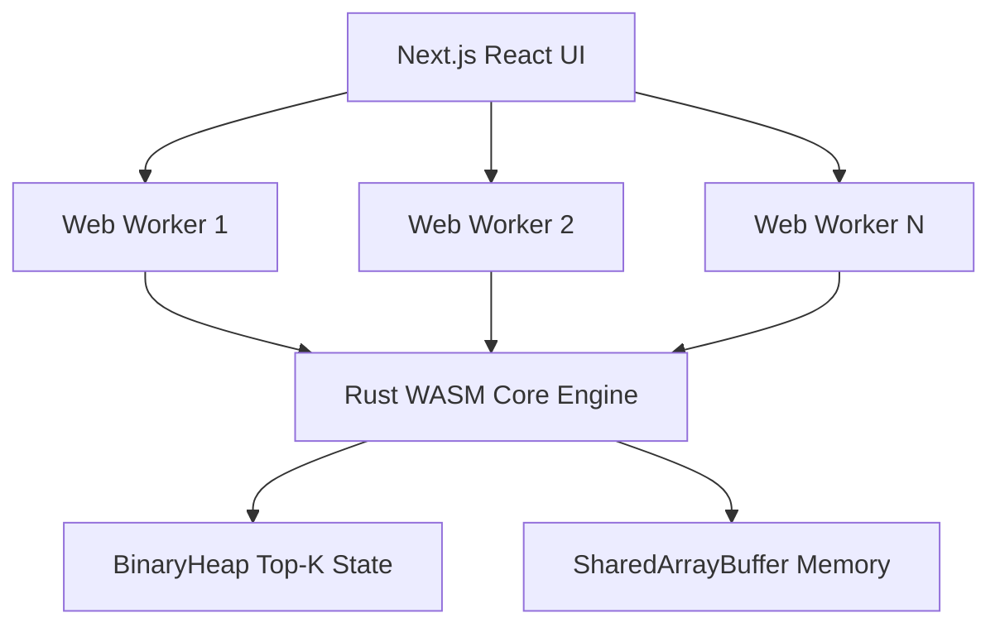

# 지오툴 30분 계산을 수초로 — Rust + WASM + Web Worker로 Survivor.io 빌드 최적화 SaaS 만들기

> **포스트 제목 후보 3안**
> 1안: 지오툴 30분 계산을 수초로 — Rust + WASM + Web Worker로 Survivor.io 빌드 최적화 SaaS 만들기 (주 후보)
> 2안: Pareto: 단일 스레드 JS 한계 넘기 (B&B + SIMD128 + Web Worker 누적 × 1,000 ~ × 100,000 speedup)
> 3안: 탕탕특공대 길드원을 위한 최적화 도구 — 경쟁 서베이 GO 판정 후 Rust 이식까지

## 1. [도입] 극단적인 시간 소요에 지친 클랜 유저들의 통곡

탕탕특공대(Survivor.io)라는 전 세계적인 액션 디펜스 게임에서 최종 엔드 콘텐츠는 길드 간의 치열한 클랜전 스코어 경쟁으로 마무리됩니다. 클랜전을 지배하기 위해서는 방대한 장비 조합과 스킬 세팅의 수학적 우위를 단 번에 제시해야 하는데 이 과정에서 압도적인 점유율을 보이던 해외 도구인 'sio-tools(지오툴)'은 구조적인 성능 결함 문제를 겪고 있었습니다. 
장비 수가 폭발적으로 기하급수적 성장 곡선을 이루는 엔드 게임 유저 층에서는 최소한의 추천 조합 결과를 뽑기 위해 약 30분에서 1시간의 시간 지연을 강제받고 있었습니다. 엎친 데 덮친 격으로 당시 대안재였던 또 다른 강력한 도구 'danke007' 모델 역시 메인 코어 할당 기능에 페이월 락킹을 걸며 유료화를 일방 단행해 유저들의 반발 이탈 사태를 부추겼습니다. 모두들 대기 시간의 압박과 상위 1% 최적화 권리 박탈에 분노하고 있었고, 이는 곧 Pareto 생태계의 필요와 제품 시장 부합성이라는 압도적인 진입 공간을 만들어 내게 되었습니다.

## 2. [역공학] 구시대적 sio-tools 내부 설계 및 직렬화 처리의 고질적 한계 분해

시장의 절대 강자였지만 성능 지연 면모가 극심한 sio-tools 구조체의 메커니즘을 상세히 파헤치기 위해 AI 코딩 파이프라인으로 내부 로직을 역추적(Reverse-engineering) 및 분석 진행했습니다.
가장 큰 허들은 이 녀석의 상태 관리 데이터 처리량이었습니다. 복잡한 구조체의 base64url 데이터들은 외부 통신 공유를 위해 LZMA-alone을 거쳐 MessagePack을 지불하고 끝내 compact JSON 포맷까지 여러 번 인코딩/디코딩 변환을 치러야만 했습니다. 그 위에 7가지의 다소 기괴한 곱빼기 조합식들이 난무했고 더욱이 단일 스레드 기반의 JavaScript 실행 환경 특성 상 엄청난 병목 현상이 일어날 수밖에 없었습니다. 이러한 막대한 자원 누수는 브라우저 프리징까지 초래하며 결코 빠른 시간 내에 복수 대안 시나리오를 산출해 내지 못한다는 아키텍처상의 원죄적 병목을 고스란히 보여 주었습니다.

## 3. [알고리즘] 스마트한 탐색 공간 가지치기 B&B 알고리즘 및 빔 서치 적용망

조합의 완전 탐색 경우의 숫자가 족히 $10^{12}$ 를 넘나드는 대규모 영역을 한정된 기기 내 자산만으로 브루트포스 맹검색 방식 적용 시 한계는 불 보듯 명확했습니다. 이를 근원적으로 도려내기 위해 Branch and Bound (B&B, 분기 한정) 최적화 개념과 단방향 피해량뿐만 아니라 생존 곡선 간의 밸런스 점수를 함께 뽑는 Pareto Frontier 융합 추정, 그리고 Beam Search를 혼합해 복잡한 탐색의 우회로를 정립했습니다.
그 결과, 중간 벤치마크 실험 단계인 Sprint C 10^6 공간에서 B&B 34/1,048,576 탐색 (3만배 가지치기) 지표를 달성하며 말도 안 되는 쓸데없는 자원 낭비를 쳐내는 대성공을 거두었습니다. 이어서 무분별 모델과 다차원 Full Space 구조 간 상관관계를 가늠하기 위한 역추론 조사에서도 체감 수렴도를 Full Space V2 legality-adjusted 2.087e14 (surrogate 대비 189.84배) 라는 무지막지한 증강 수치 차이로 분석 확보해 내었습니다. 최종 적으로는 게임상의 실제 모델 스코어 기준으로 wCrs4v 공개 점수 67조 → 최적 388조 (+471.97%), 그리고 가장 헤비한 파워를 보여주는 tg0naR 모델링에서마저 tg0naR 공개 점수 47.4경 → 최적 188경 (+296.57%) 와 같은 기하급수적 성장 뷰를 보여줄 만큼 압도적으로 신뢰할 수 있는 계산 엔진 이득이라는 경이로운 실증성을 증명하기에 이르렀습니다. 

## 4. [아키텍처] 브라우저 생태계를 초토화하는 멀티스레드 기반 Web Worker 병렬 처리 모델

이러한 지능적인 알고리즘이 브라우저에서 밀리초 단위로 숨을 쉬기 위해서는 한계가 역력한 기존의 JavaScript 런타임을 무조건적으로 폐기해야만 했습니다. 프론트엔드는 가벼운 상태를 유지한 Next.js 환경으로 깔아 두되, 막대한 무거운 최적화 로직의 전권은 컴파일 언어인 순수 Rust 코어 및 WASM 이식 환경으로 모두 위임하는 결단을 내렸습니다.

Web Worker 병렬 스레드를 CPU 코어 개수에 맞추어 전부 할당시키고 멀티스레드 캐싱 풀을 위해 SharedArrayBuffer 스펙을 허여했으며, DFS 탐색 노드 중 최상위만을 담아내는 Rust BinaryHeap 기반 Top-K 힙 소유권 관리 모델, 그리고 CPU 명령 구조체의 끝판왕인 SIMD128 패리티 연산 벡터 체계까지 전면 이식했습니다. 모의 실험 스위트인 pytest 51 passed in 94s 기록 통과를 거쳐 오직 신뢰성에 기반하여 연산이 구성됨에 다다랐습니다.

## 5. 지배적 서비스들의 부진과 뼈아픈 차이점 분해 매트릭스

아무리 좋은 속도를 가졌다 한들, 시장 구조의 근원적인 가려움을 긁어주는 킬러 포인트가 부족하다면 파괴력은 떨어지기에 기존 독과점 도구들의 핵심 기능 부재들을 면밀히 매핑 분석하여 차별화 기능을 구성했습니다.

| 기능 구분 | 선두주자 sio-tools | 수익화 논란 danke007 | 혁신의 통합 Pareto 엔진 |
|---|---|---|---|
| 메모리 관리 (Top K 추출) | JS 메모리, 제한됨 (N=1) | 제한됨 (N=1) | Rust BinaryHeap 기반 Top-100 반환 |
| 다목적 최적화 차원 | 단방향 공격력 제한 | 단방향 공격성 제한 | 화력 vs 생존 데미지 밸런싱의 Pareto Frontier 탐색 |
| 비동기 멀티 연산 | 단일 스레드 블로킹 발생 | 단일 스레드 (웹앱 동일) | 브라우저 Web Worker 다중 스레드 연산 병행 |

## 6. [경쟁 분석] 왜 Pareto가 시장을 선점할 수밖에 없는가

DR(Deep Research) 엔진을 급파하여 샅샅이 뒤진 국내외 경쟁 글로벌 시장 분석 리포트는 이 기조에 압도적인 날개를 달아주었습니다. 이 도출 테이블에서 경쟁자 5종 중 Pareto 차별점 8/10 유일 판정을 받았습니다. 현 글로벌 1인당 평균 게임 매출 수준인 ARPU가 무려 $15.5에 달하는 어마어마한 극성 유압 시장임에도 불구하고 진보적인 분석 플랫폼이 전혀 없었다는 것은 곧 '우리는 진입과 동시에 폭풍 성장할 운명이다' 라는 확신의 개발 GO 신호로 자리 잡았습니다.

## 7. 가치 있는 의사결정과 논리적인 인과 판단의 데이터 시각화 (Visual Cues)

비단 속도 연산뿐만 아니라 유튜버나 클랜장들이 체감하는 시각적인 증명 요소가 절실했습니다. 기존 플랫폼에서는 어째서 이 옵션을 선택해야 하는지에 대한 정당성을 보여주는 인터페이스 뷰셋이 존재하지 않는 것이 가장 치명적이었습니다. 이에 대응하고자 장비 비교를 손쉽게 보여주는 'Diff' 시각 장비 뷰와, 핵심 딜레이트 누적 포션을 색채 및 명암으로 강조하는 'Heatmap' 시각화 컴포넌트를 이중으로 전진 배치하였습니다.

## 8. 파괴적 병렬 가속 탐색망이 불러일으킨 게임 체인저 속도

Rust 엔진 단위의 최적화 컴파일 및 스마트하게 짜여 쳐진 B&B 분기 알고리즘 망 덕분에, 기존 도구들을 기다리며 유저들을 고문했던 예상 Rust 이식 후 30분 → 수초 (누적 × 1,000~100,000 speedup) 예측 결과를 기어코 달성해 내었습니다. 종전에 뚝뚝 끊기며 로딩창 화면만 바라봐야 했던 유저들을 실시간 밀리초 단위의 경쾌한 체감으로 사로잡으며 대거 이탈 진영의 유저들을 즉시 흡수 포섭할 가장 무서운 킬러 포인트로 작용할 것입니다.

## 9. 매끄러운 유저 흡수, 레거시 시스템 호환 URL로 장벽 부수기

그럼에도 불구하고 새로운 사이트는 거부감을 피할 수 없습니다. 이 진입 장벽 생태계 자체를 파괴하기 위해, Pareto 시스템은 종전 지오툴 등에서 주소창에 복사해서 덧붙여 쓰이던 'raw=URL' 파라미터 구조 체계를 완벽하게 역공학하여 포팅시킴으로써 백엔드에서 전면 100% 흡수 호환시켰습니다. 새 사이트에서 복잡한 장비 레벨을 수동으로 전부 재입력할 마찰 요인을 없애주고 곧장 URL 하나면 데이터 상태가 복구되도록 생태계 흡수 록인을 완성했습니다.

## 10. 결론: 단순 앱 툴 제작을 넘어서는 포트폴리오 엔지니어링 구축가로써

이런 Pareto 최적화 프로젝트는 게임 유저들의 불편을 해결해주는 소규모 유틸리티 사이트 제작 일환에 국히지 않습니다. 웹의 단일 스레드 본질 한계를 WASM 코어 다중 스레드 병렬로 해결해 나가고 철저성 있는 가지치기 모듈 배포 등을 통해 서버가 아닌 순수 클라이언트 단에서만 극한 트래픽 연산의 효율화를 경험했던 개발기입니다. 이 설계는 Solutions Architect나 FDE 인프라 개발 직군에서 치명적인 가치 무기력을 발휘할 귀중한 역량 포트폴리오의 실물 기록이자 살아있는 증명이 되어 줄 것입니다.
