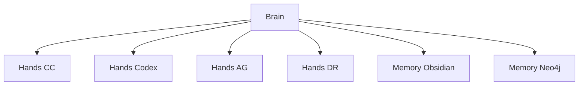

# 4엔진 AI 오케스트레이션으로 개인 운영체제 만들기 (feat. Woosdom Brain)

> **포스트 제목 후보 3안**
> 1안: 4엔진 AI 오케스트레이션으로 개인 운영체제 만들기 (feat. Woosdom Brain) (주 후보)
> 2안: Claude + Codex + Gemini + Antigravity: 개인이 풀스택 AI 팀을 운영하는 법
> 3안: AI Brain-Hands-Memory 3계층 아키텍처 — Obsidian + Neo4j로 100일 만든 시스템

## 1. [도입] 왜 개인에게 AI 오케스트레이션이 필요한가

현재 우리가 마주하고 있는 인공지능 시대에서 단일 대형 언어 모델(LLM) 기반의 챗봇은 매우 훌륭한 타이피스트이자 어시스턴트 역할을 수행합니다. 하지만 단일 에이전트는 결코 프로덕션 시스템의 모든 생명주기를 감당하는 '아키텍트'를 대신할 수는 없습니다. 비즈니스를 기획하고, 소프트웨어 아키텍처를 설계하며, 수학적인 백테스팅을 거치고 최종적인 시스템을 배포하는 과정은 본질적으로 다양한 전문성을 조율해야 하는 '실무 복합 태스크'입니다. 

개발자 혼자서 복잡한 요구사항을 소화하기 위해서는 대화창 위주의 챗봇에 의존하는 것을 넘어, 마치 회사의 조직을 구성하듯 작업을 위임하고 상호 검증할 수 있는 개인 전용 운영체제가 필요했습니다. 인간의 의사결정을 자동화하고 단일 LLM의 컨텍스트 초과와 기억 부재라는 근본적인 한계를 시스템적으로 극복하기 위해, 저는 4개의 서로 다른 인공지능 엔티티를 연결한 개인 관리망 'Woosdom Brain' 시스템을 100일 스크린 하에 직접 설계 및 운용하게 되었습니다.

## 2. 단일 모델 기반 방식과의 구조적인 차이점

하나의 인공지능에게 모든 역할을 집중적으로 배정하는 것은 마치 한 명의 직원에게 기획과 코딩, 감사를 모두 일임하는 것과 같습니다. 이는 필연적으로 치명적인 오류를 발생시킵니다. 시스템적인 품질 보증을 위해서는 철저한 분리와 상호 검증 장치가 도입되어야만 합니다.

| 핵심 비교 축 | 단일 LLM 의존 방식 | 4엔진 오케스트레이션 체계 |
|---|---|---|
| **기능의 전문성 단위** | 코드 작성 단계부터 연산까지 단일 에이전트 전담 | 전략, 코드 작성, 수치 연산, 웹 검색 분야별 전문가 분할 |
| **메모리의 보존 방식** | 세션 종료 시 맥락이 휘발되는 단편적 지식 | Obsidian + Neo4j GraphRAG 인프라 상의 영구적 보존 방식 |
| **품질의 통제 메커니즘** | 본인이 생성한 결론을 자체 리뷰하여 환각 노출됨 | 각 엔진 교차 검증 및 무결점 증명 기반 시스템 배포 방식 |

## 3. [아키텍처] Brain-Hands-Memory 3계층

시스템 설계의 가장 기본 뼈대는 사람의 인지적 활동을 모방한 논리적 계층 분리 모델에서 출발했습니다. 전체 환경은 크게 전략적 판단을 내리는 두뇌(Brain), 실질적인 작업을 실행하는 손(Hands), 그리고 의사결정의 근거가 되는 장기 저장 구조망(Memory)의 3가지 계층으로 분할되어 있습니다.

## 4. 엔진들의 고유 역할과 워크로드 정밀 분배

중간 계층에 해당하는 Hands 그룹은 철저하게 고도화된 4개의 AI 엔진으로 역할을 나누어 병렬 연계를 처리합니다. 
로컬 파일 시스템 제어와 커맨드 라인을 담당하는 핵심 주력 개발 인력은 Claude Code(CC)가 수행합니다. 이에 반해 고난이도 시스템의 백테스팅과 파이썬 수치 연산, 비동기 파이프라인 처리는 전적으로 OpenAI 기반의 Codex가 처리합니다. 한편 큰 그림의 시스템 구조화 지시서를 작성하거나 문서화 및 코드 평가를 내리는 업무는 Antigravity IDE (AG)가 분담하며, 웹 시장 동향 조사 및 실증 데이터 수집 전반은 Deep Research (DR) 시스템이 맡고 있습니다. 
이처럼 개별 임무를 특성화함으로써, 하나의 질의응답 사이클에서 발생할 수 있는 교착 상태를 완벽히 막아냈고 4엔진 병렬 처리로 단일 Claude 대비 3~5배 처리량 증가라는 압도적 스케일업 효과를 직접 확인할 수 있었습니다.

## 5. [프로토콜] 엄격한 3-Gate System 인프라 제어망

뛰어난 작업자들을 확보했더라도 무계획하게 일을 지시하게 되면 일관성 없는 스파게티 레거시로 조직은 곧장 추락하게 됩니다. 이러한 부작용을 통제하기 위해, 모든 워크로드는 철저히 3개의 게이트(Gate)로 규정된 결재 단계를 거쳐야만 작동됩니다. 
가장 초기이자 승인 단계인 Gate 1 (THINK) 과정에서는 현재 제안된 작업이 기존의 아키텍처 원칙에 부합하는지 꼼꼼히 살핀 후 요구사항을 Sprint 단위 분해 평균 T1~T7 7 서브태스크 단위로 세밀하게 쪼개어 할당하게 됩니다. 
이어서 Gate 2 (DELEGATE) 단계에서는 요구 특성에 맞춰 가장 적합한 엔진 하나를 골라 세부 실행 지시서를 통보합니다. 업무가 종료되면 마지막 Gate 3 (VERIFY) 문턱 앞에서 작업자가 제시한 실행 결과 및 코드의 신뢰도와 무결성을 최종 체크 및 수용하는 절차를 따르게 됩니다.

## 6. 오류의 원천 차단을 위한 자체 모니터링 품질 관리망

이 거대한 딥러닝 기반 생태계에서 '할루시네이션(환각)'이라는 부작용은 항상 가장 큰 골칫거리입니다. AI는 종종 일을 마무리하지 않았으면서도 완료했다고 정교하게 포장된 가짜 보고서를 제출합니다. 이러한 허위 검증을 차단하기 위해 Brain Spot-Check 라는 불시 검문 자가검증 시스템을 내재화시켰습니다. 
에이전트가 거짓된 리뷰와 누락 사실을 넘기려 했을 때 감시 시스템은 fail 코드를 선언하며 경고를 발동시킵니다. 실제로 발생한 모든 크리티컬 이슈에 대해, 프로젝트 전반에 걸쳐 failure_log 누적 30건 이상 자가 기록 문서를 축적해 왔고 이런 엄격한 훈련 하에 AI의 무사안일주의적 태도를 구조적으로 통제하고 관리할 수 있었습니다.

## 7. [실전 케이스] 100일간 3개 복합 프로젝트의 동시 개발 성과

지난 100일 간의 운용 결과는 실로 환상적이었습니다. 총 시간 동안 100일 누적 대화 세션 S1~S50+ 스냅샷을 쌓으며, 성격이 근본적으로 다른 수준 높은 3개의 엔지니어링 궤도를 동시 운영해 냈습니다.
데이터 기반 건축 법규조회 솔루션 제품인 Blocs 에 더해, 탕탕특공대의 전방위적 게임 장비 조합 효율을 다목적으로 계산하는 Pareto 프로젝트 개발기, 그리고 전수 시뮬레이션을 기초로 레버리지를 걷어낸 Trinity v5 자산 투자 체계까지 모두 혼선 없이 성공리에 포진시킬 수 있었습니다. 이렇게 흩어진 환경을 안정적으로 엮기 위해서는, 보이지 않는 곳에서 코드 안정성을 지켜주는 거대한 테스트 커버리지가 뒷받침되어야 했고 이를 위해 전체 프로젝트 파이프라인에서 pytest 574 + vitest 161 + E2E 55 규모 테스트 망 인프라스트럭처를 가동시켰기에 일구어낸 일입니다.

## 8. 개인의 자산을 잃지 않는 장기 영구 데이터베이스

과거의 인공지능 상호작용은 그저 사라지는 대화에 불과했지만, 저의 운영체제는 기억의 휘발을 차단합니다. 메모리 그룹에 속하는 Obsidian과 Neo4j 그래프 데이터베이스 기반의 영구적 하이브리드 RAG 메모리에 의존하며 모든 결정의 흔적을 영구히 남기고 있습니다.
현재까지 집계된 아카이브 공간은 Obsidian 볼트 1,248 노트 + Neo4j 3,756 노드 구조망에 달하며 매 스냅샷 순간의 모든 비즈니스 도메인 지식, 시스템 온톨로지, 전략 논리들을 촘촘히 엮어 새로운 인사이트가 도출되는 시너지를 내뿜고 있습니다. 이렇게 구조화된 지식망은 추후 발생하는 다양한 프로젝트에서 그 위력을 입증하게 됩니다.

## 9. [교훈] 오케스트레이션이 빠지기 쉬운 환각과 나태함의 함정

그럼에도 불구하고 이 체계가 완벽한 유토피아 구조만을 자아낸 것은 결코 아니었습니다. 가장 위험했던 순간은 시스템을 감시하고 지휘해야 할 지휘자 자체, 이른바 Brain 프로세서가 직무 태만에 빠졌던 사건입니다. 
지시를 위임하는 과정에서 자율 엔진들에게 판단 권한까지 과도하게 넘겨서 단일 의존성을 초래하거나 편향 현상이 일어난 적이 있습니다. 또한 검문 및 결재 과정인 Gate 3에서 세부 문맥을 간과하고 리포트의 표면적 완료 여부만을 무비판적으로 추인하는 사태가 발생하여 Gate 3 Spot-Check 16회차 중 허위 통과 3건 탐지 라는 뼈아픈 기록과 모순을 낳기도 했습니다. 이 경험은 인간 관리자의 최종 점검 기능이 그 어떤 알고리즘 최적화 과정에서도 결코 배제되어서는 안 된다는, 운영 체계상의 냉정한 안전핀이자 차가운 교훈을 고스란히 남겨 주었습니다.

## 10. 결론: 기술 진화 속에서도 흔들리지 않는 가벼운 개인 운영체제의 시사점

Woosdom Brain 인프라는 최신의 복합한 대형 언어 모델들을 유행에 맞춰 병렬적으로 조합한 단순한 테크 오락 거리가 아닙니다. 수많은 불확실성의 잡음 속에서 도메인의 원천적 요구 사항을 분리하고 자원을 할당하여 솔루션을 조율하고 구현해야 하는 Solutions Architect(SA) 혹은 FDE 역할에서 맞닥뜨리게 될 축약판과 같습니다.
앞으로 엔진 알고리즘의 발전 속도는 더욱 거침없고 빨라지겠지만, 이들을 어떻게 통제된 신뢰 하에 결합하여 비즈니스 가치로 이끌어낼 것인가에 관해 고심해 낸 전체론적 아키텍처 경험은 장기적인 전략 포트폴리오로 막대한 가치를 지닐 무형의 자산이자 저만의 시그니처 프레임워크로 자리잡을 것입니다.
